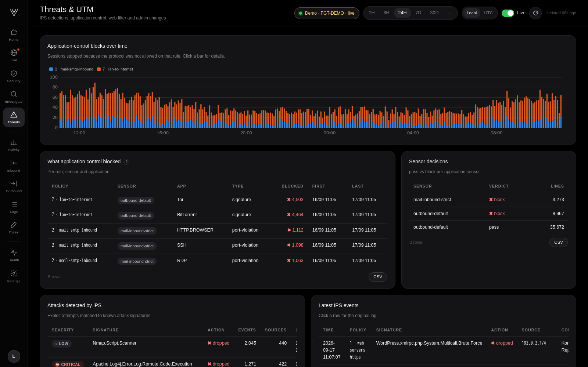
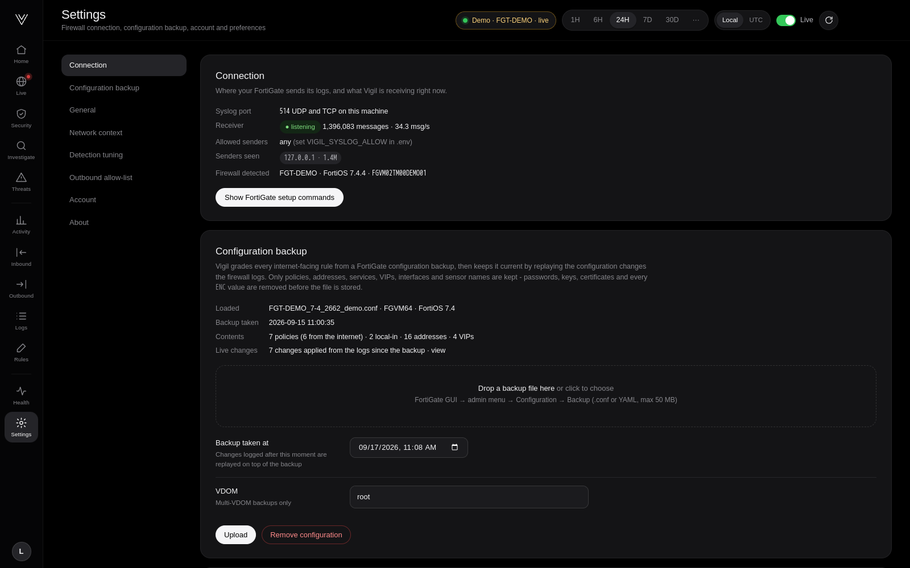

<div align="center">


# Vigil

**See what your FortiGate sees.** Live threats, risky rules and one-click investigations from plain FortiGate syslog —<br>
self-hosted, a single container, running in about a minute.

[Quick start](#quick-start) · [Screenshots](#a-quick-tour) · [FortiGate setup](docs/FORTIGATE.md) · [Install guide](docs/INSTALL.md) · [Blog post](docs/blog/introducing-vigil.md)


</div>

> Every screenshot in this repository comes from Vigil's built-in **demo mode**: a fictional firewall (`FGT-DEMO`) with
> documentation-only IP addresses. No real network data is shown.

## Why Vigil

FortiGate logs already contain the answers to the questions that matter — *who is attacking us, which rule let them in,
why was this user blocked?* — but they arrive as millions of raw lines. Vigil turns them into a calm, readable picture:

- **Live traffic in 3D.** Every inbound request flies into a model of your firewall: allowed traffic passes through to the
  service, denied traffic bounces off, and the reason is colour-coded (closed port, source not allowed, deny rule, aimed at
  the firewall itself, security profile, IPS). Freeze the scene and **click any single request** to see its original log line.
- **Inbound security grade.** Upload a configuration backup and every internet-facing rule gets a 0–100 risk score:
  who can reach it, what it exposes, known exploited vulnerabilities for that kind of service, missing IPS or application
  control — and the exact FortiOS commands to tighten it.
- **Configuration changes, live.** Vigil reads the FortiGate's own change log. Disable a rule, change its source, swap a
  sensor — the score updates within seconds and you see who changed what.
- **Investigations in plain English.** Ask *"why was 198.51.100.201 blocked?"* and follow the request hop by hop: policy,
  NAT, security profiles, final decision, correlated sessions.
- **Attack detection.** Port scanners, password guessing, IPs that were blocked and later got in, exploit attempts,
  wrong-protocol tunnels, traffic spikes and new source countries — all with evidence.
- **Everything else you expect.** Outbound domains and machines, threats and UTM, log explorer, rule assistant, health.

## Quick start

**Requirements:** any Linux machine (or VM) with [Docker](https://docs.docker.com/engine/install/) — 2 CPUs, 2 GB RAM and
20 GB of disk are plenty for a typical firewall. The FortiGate must be able to reach it on UDP or TCP port 514.

```bash
git clone https://github.com/MrkktestHari/vigil.git
cd vigil
docker compose up -d
```

Open **http://&lt;this-machine&gt;:8080**, create the administrator account, and follow the on-screen
**Connect your FortiGate** checklist. On the firewall it comes down to:

```
config log syslogd setting
    set status enable
    set server "<this-machine-ip>"
    set port 514
    set format default
end
```

Logs start appearing within seconds. Details, TCP syslog and multi-firewall setups: [docs/FORTIGATE.md](docs/FORTIGATE.md).

### Try it without a FortiGate

```bash
VIGIL_DEMO=1 docker compose up -d
```

Demo mode generates two days of realistic traffic from a fictional firewall, then keeps it live. Remove the container and
its volume (`docker compose down -v`) before connecting a real firewall.

## A quick tour

| | |
|---|---|
|  **Live traffic** — every inbound request in real time, colour-coded by why it was denied, with a timeline to replay any moment. |  **Capture one request** — freeze the scene, click a particle, read the original log line and investigate it. |
|  **Inbound security** — a grade, what to fix first, and the attacks happening right now. |  **Rule by rule** — who can connect, what is exposed, how it could be attacked and how to fix it. |
|  **Investigate** — search in plain words, get correlated sessions, timelines and scanner history. |  **Live configuration** — every change the firewall logged, applied to the risk score. |
|  **Threats & UTM** — IPS, application control, web filter and admin activity. |  **Settings** — connection status, configuration backup upload, tuning and account. |

## Features in detail

| Area | What you get |
|---|---|
| Ingestion | Built-in UDP/TCP syslog receiver (RFC 3164/5424, octet counting). Both FortiOS formats: `default` and `cef`. Exactly-once processing across restarts and file rotation. |
| Storage | SQLite with 5-minute and hourly summaries. Detailed rows kept for a configurable number of days (default 30), summaries for up to a year. |
| Live view | 3D firewall with per-request particles, deny reasons, closed-port "doors", replay timeline, freeze / slow motion, single-request capture, full screen. |
| Security | Rule risk scoring, exposed services, CISA KEV references, MITRE ATT&CK techniques, suggested FortiOS hardening commands, firewall admin-plane checks. |
| Detections | Port scans, password guessing, recon-then-access, IPS exploit attempts, protocol abuse, traffic spikes, new countries. |
| Investigations | Natural-language search, 30-day search with time budgets, session correlation, hop-by-hop path, decision explanation, entity traces. |
| Config tracking | Import a `.conf` or YAML backup (secrets removed on upload), then follow every change from the firewall's change log. |
| Operations | Health page, memory and CPU guards, automatic component restart, container health check, CSV export. |

## Configuration

Copy `.env.example` to `.env` to change defaults — everything is optional:

| Variable | Default | Meaning |
|---|---|---|
| `VIGIL_HTTP_PORT` | `8080` | Web UI port on the host |
| `VIGIL_SYSLOG_PORT` | `514` | Syslog port on the host (UDP and TCP) |
| `VIGIL_SYSLOG_ALLOW` | *(anyone)* | Comma-separated IPs/CIDRs allowed to send syslog |
| `VIGIL_RETENTION_DAYS` | `30` | Days of detailed log rows to keep |
| `VIGIL_MEM_LIMIT` | `4g` | Container memory limit |
| `VIGIL_DEMO` | `0` | `1` = fictional demo traffic |
| `VIGIL_ADMIN_USER` / `VIGIL_ADMIN_PASSWORD` | — | Create the admin account automatically instead of the first-run page |

Everything Vigil stores lives in the `vigil-data` Docker volume. See [docs/INSTALL.md](docs/INSTALL.md) for HTTPS behind a
reverse proxy, backups, upgrades and uninstalling.

## Security and privacy

- Vigil never connects to the FortiGate and never sends data anywhere — it only receives syslog.
- Configuration backups are stripped of passwords, keys, certificates and all `ENC` values before they are stored.
- The administrator password is stored as a salted PBKDF2-SHA256 hash; sessions use signed, HttpOnly cookies; repeated
  failed logins are rate limited.
- Put Vigil on a management network and, for access beyond it, behind an HTTPS reverse proxy. See [SECURITY.md](SECURITY.md).

## Documentation

- [Install guide](docs/INSTALL.md) — requirements, HTTPS, backups, upgrades, uninstall
- [FortiGate setup](docs/FORTIGATE.md) — syslog, what to log, multiple firewalls and VDOMs, verification
- [Architecture](docs/ARCHITECTURE.md) — how data flows, storage, performance and resource guards
- [Troubleshooting](docs/TROUBLESHOOTING.md)
- [Blog: Introducing Vigil](docs/blog/introducing-vigil.md)

## Contributing

Issues and pull requests are welcome — see [CONTRIBUTING.md](CONTRIBUTING.md). Run the test suite with
`pip install -r requirements-dev.txt && pytest`.

## License

Apache License 2.0 — see [LICENSE](LICENSE) and [NOTICE](NOTICE).

*FortiGate, FortiOS and Fortinet are trademarks of Fortinet, Inc. Vigil is an independent open-source project and is not
affiliated with, sponsored by or endorsed by Fortinet.*
