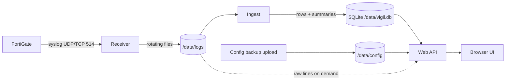

# How Vigil works

One container runs four small processes under a supervisor that restarts any of them with back-off:

| Component | Role |
|---|---|
| **receiver** (`vigil/syslogd.py`) | Accepts syslog on UDP and TCP (newline or octet-counted framing), writes `fortigate.log`, rotates by size and day, compresses old files. |
| **ingest** (`vigil/ingest.py`) | Follows the log files exactly once (file identity by content hash, offsets committed with the data), parses both FortiOS formats and writes rows and rollups. |
| **web** (`vigil/web.py`) | FastAPI JSON API + the single-page UI. Authentication, settings, configuration upload, health. |
| **demo** (`vigil/demo.py`) | Only with `VIGIL_DEMO=1`: a fictional firewall sending realistic syslog to the receiver. |

## Parsing

`vigil/cef.py` turns both FortiOS syslog formats into one record shape (the CEF field names FortiOS uses), so every other
module is format-agnostic. Event time comes from `eventtime` (nanoseconds) - the syslog header clock is often local time.

## Storage

- **Detailed rows** for sessions, application control, web filter, IPS, antivirus and events - kept `VIGIL_RETENTION_DAYS`.
- **Scanner noise** (internet traffic hitting the implicit deny, denied local-in) is stored only as per-hour / per-day
  counts by source, port and country. The raw lines stay in the rotated log files and are read on demand by investigations.
- **Summaries** (1-minute, 5-minute, hourly, daily) power the charts and 30-day views and are kept longer.
- **Configuration changes** from the FortiGate change log are kept for 400 days.

## Live configuration

The uploaded backup is the baseline. Every `Object attribute configured` event logged afterwards is replayed on top in
order (edits, additions, deletions; long values split over several log lines are rejoined). The inbound security page is
re-scored against that live model on every request (~10 ms), while the log statistics come from a cache. What logs cannot
tell - the new position of a moved rule, changes made while logs were not received - is flagged rather than guessed.

## Performance and resource guards

| Guard | Default |
|---|---|
| SQLite page cache per reader / sorts | 16 MB / spill to disk |
| SQLite heap limit (queries fail instead of exhausting memory) | 1 GB (`VIGIL_SQLITE_HEAP_MB`) |
| Worker threads / concurrent heavy queries | 12 / 3 (`VIGIL_THREADS`, `VIGIL_HEAVY`) |
| Search time budget | 15 s, with "search older" continuation |
| Web process memory watchdog | sheds caches, restarts above `VIGIL_MAX_RSS_MB` (2 GB) |
| Container memory | `VIGIL_MEM_LIMIT` (4 GB) |

Heavy dashboard ranges (24 h, 7 d, 30 d) are pre-computed by a background warmer so they open instantly.

## Security model

- Single administrator account; PBKDF2-SHA256 (600k iterations) password hash, random session key, HttpOnly SameSite cookies,
  login rate limiting, first-run setup closes after the account exists.
- The container runs as an unprivileged user; the receiver listens on port 5514 inside the container.
- Logs, configuration and investigations never leave the host. The only outbound request is an optional anonymous daily usage ping (random install ID, version, rough log volume) that you can turn off with `VIGIL_TELEMETRY=off`.
  Front-end libraries are bundled into the image at build time (checksum-verified).
