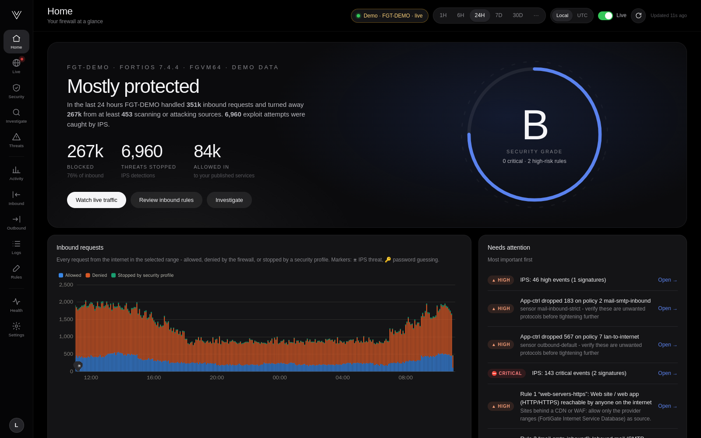
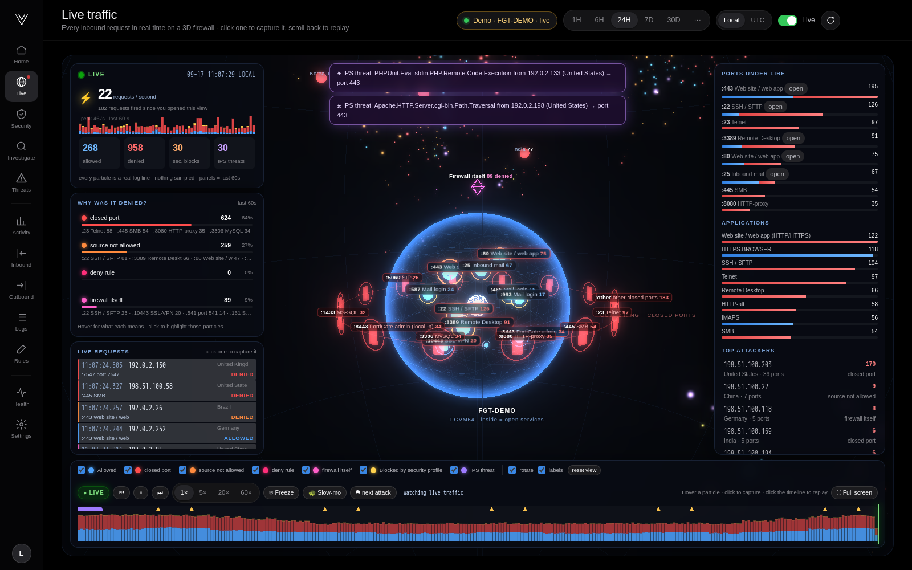
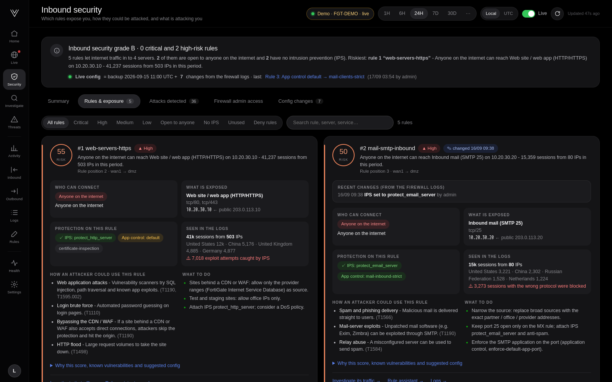
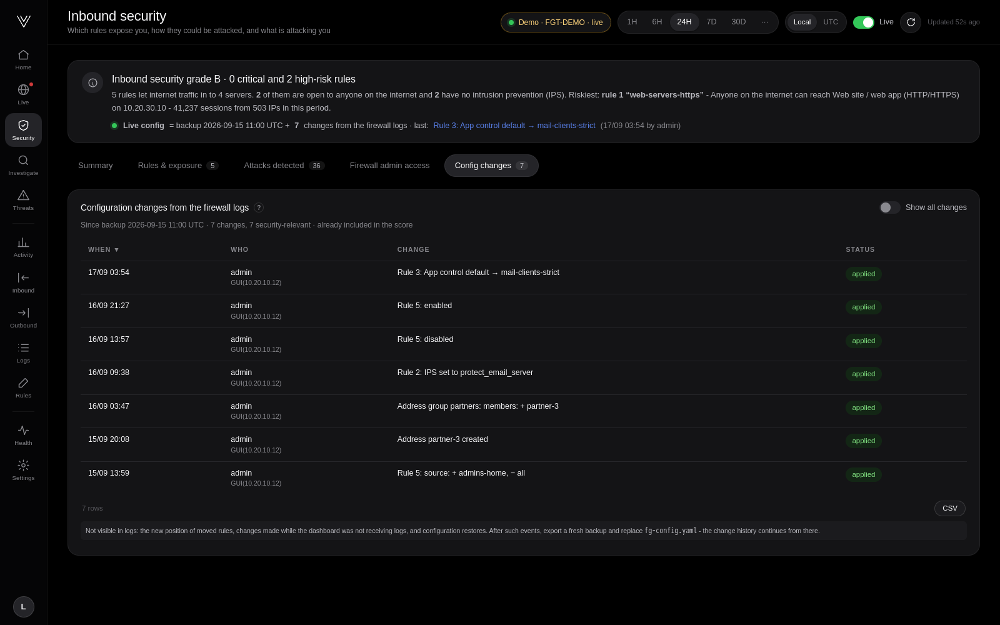
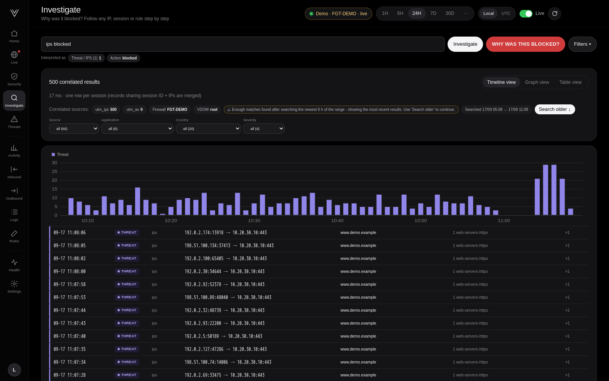

# Introducing Vigil: see what your FortiGate sees

*September 2026 · 6 minute read*



Every FortiGate keeps a detailed diary. Each allowed session, each blocked scan, each exploit attempt caught by IPS and each
configuration change is written to a log line. The problem is volume: a single internet-facing firewall easily writes
millions of lines a day, and the questions people actually ask - *are we being attacked right now? which rule let that IP
in? why can't this user reach the service?* - are buried in them.

**Vigil** is a free, open-source dashboard that turns FortiGate syslog into answers. It runs as one Docker container, needs
nothing installed on the firewall, and is ready in about a minute.

```bash
git clone https://github.com/MrkktestHari/vigil.git && cd vigil && docker compose up -d
```

> All screenshots below come from Vigil's demo mode - a fictional firewall called `FGT-DEMO` using documentation-only IP
> ranges. You can run the same demo with `VIGIL_DEMO=1 docker compose up -d`.

## A calm home screen

The home screen answers one question: *is everything all right?* It shows how many inbound requests were blocked, how many
exploit attempts IPS stopped, what was allowed in, and a security grade for the rules that face the internet. Underneath,
a short list tells you what needs attention first - in plain language, with a link to the evidence.

The design is intentionally quiet: a black canvas, large light numbers and very little chrome, so the few things that
matter stand out.

## Watching the internet knock on the door



The **Live** view draws your firewall as a glass sphere. The services your rules really publish sit inside it. Every
inbound request is a particle flying in from its country of origin:

- **Blue** requests pass through the glass to the service they were allowed to reach.
- **Red** requests hit a *closed port* - no rule opens it, so they bounce off one of the "doors" on the outer ring. This
  is what internet scanning looks like, and there is a lot of it.
- **Orange** requests aimed at a port that *is* open, but from a source that rule does not allow.
- **Pink** requests were aimed at the firewall itself - admin pages, VPN portals, SNMP.
- **Yellow** and **violet** requests were allowed by a rule and then stopped by a security profile or matched an IPS
  signature.

On the left, a live counter shows requests per second and *why* traffic was denied. Below, a timeline covers the whole
selected range with markers for exploit attempts and password guessing; click anywhere to replay that moment.

The part people enjoy most: press **Freeze**, click any particle, and Vigil shows that exact request - source and port,
public address, NAT translation, rule, application, client reputation - read back from the original log line.


## Which rules put you at risk?


Upload a FortiGate configuration backup (passwords, keys and certificates are removed before anything is saved) and Vigil
grades every rule that lets internet traffic in. The score combines a handful of questions a security reviewer would ask:

1. **Who can connect?** Anyone on the internet, whole countries, cloud provider ranges, or only approved addresses.
2. **What is exposed?** A web site is a different risk from remote desktop, a database or the firewall's own admin page.
3. **Is the software actively exploited?** Vigil references the CISA Known Exploited Vulnerabilities catalog for each kind
   of service.
4. **Is anything inspecting the traffic?** No IPS sensor or a monitor-only application sensor raises the score.
5. **What do the logs show?** Password guessing against the rule adds to the risk.



Each rule gets a card that explains, in a sentence, who can reach what - plus how an attacker could use the rule
(with MITRE ATT&CK techniques), what to do about it, and the FortiOS commands to tighten it.

## Configuration changes, the moment they happen

A backup is a snapshot; firewalls change daily. Vigil keeps up without any access to the firewall by reading the
FortiGate's own change log - the `Object attribute configured` events FortiOS writes for every GUI, CLI or API change.
Each change is replayed on top of the backup in order, so if someone disables a rule or widens its source, the risk score
and the rule card update within seconds, and a notification tells you who changed what.



Some things logs genuinely cannot tell - for example the new position of a moved rule. Vigil marks those rules instead of
guessing.

## "Why was this blocked?"



The **Investigate** page accepts questions the way people ask them: *why was 198.51.100.201 blocked*, *port 3389 denied from
China*, *policy 5 blocked*, a session ID or a domain. Vigil searches up to 30 days, correlates records that belong to the same
session across traffic, application control, IPS and web filter logs, and reconstructs the path - ingress interface, policy,
NAT, security profiles and the final decision - with an explanation in plain English. Where the logs do not contain a piece
of information, Vigil says so rather than inventing it.

## Built to run anywhere quietly

- **One container**, one volume, a health check, and automatic restarts of its internal components.
- **Both FortiOS log formats** (`default` and `cef`), UDP or TCP, several firewalls at once.
- **Resource guards**: bounded memory for database queries, time budgets for large searches, a memory watchdog and
  pre-computed 24-hour, 7-day and 30-day views.
- **Private by design**: no outbound connections, no telemetry, sanitised configuration storage, hashed credentials.

## Get started

1. `git clone https://github.com/MrkktestHari/vigil.git && cd vigil && docker compose up -d`
2. Open `http://<host>:8080` and create the admin account.
3. Follow **Connect your FortiGate** - two CLI blocks on the firewall.
4. Optionally upload a configuration backup to turn on rule grading.

The code is Apache 2.0 licensed. Issues, ideas and pull requests are welcome on
[GitHub](https://github.com/MrkktestHari/vigil).

---

*FortiGate and FortiOS are trademarks of Fortinet, Inc. Vigil is an independent project and is not affiliated with or
endorsed by Fortinet.*
