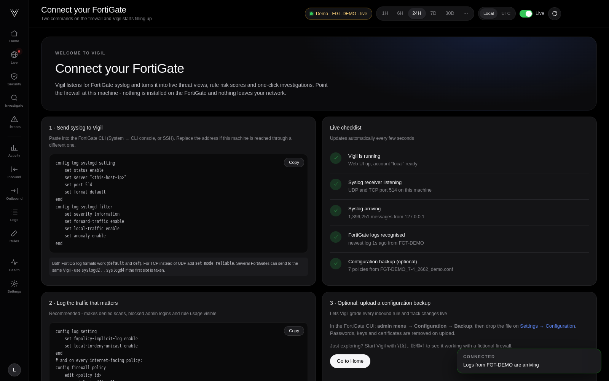

# Watch your FortiGate in 3D: a free, open-source live traffic dashboard

*September 2026 · 7 minute read · [Vigil on GitHub](https://github.com/vigiltech01/vigil)*


Every FortiGate facing the internet is under constant attack. Scanners probe every port, bots guess passwords, and
exploit kits test your web server, thousands of times an hour. It is all in the logs, but the logs are a wall of text.
Most people never see it.

**Vigil** is a free, open-source FortiGate dashboard that turns that text into something you can *watch*: a live 3D
model of your firewall with every inbound request flying in as a particle. It runs as one Docker container. The
integration is one CLI block on the firewall. Nothing is installed on the FortiGate and no credentials are needed.

```bash
git clone https://github.com/vigiltech01/vigil.git && cd vigil && docker compose up -d
```

> Every image in this post comes from Vigil's demo mode: a fictional firewall called `FGT-DEMO` using
> documentation-only IP addresses. Run the same demo yourself with `VIGIL_DEMO=1 docker compose up -d`.

---

## The live 3D view


Open **Live** and you are looking at your firewall as a glass sphere.

- **Inside the sphere** are the services your firewall really publishes to the internet: your web site, mail server,
  VPN portal, a partner SFTP. What you see is what the internet can reach.
- **Around the sphere** is a ring of red "doors": ports that are *closed*. No rule opens them, so every request that
  hits one is dropped at the edge.
- **Every particle is one real log line.** Requests fly in from their country of origin, and where they end up is
  the firewall's decision.

The colour tells you the outcome at a glance:

| Colour | What happened |
|---|---|
| **Blue** | Allowed. The particle passes through the glass to the service it was allowed to reach. |
| **Red** | Closed port. It bounces off a door. This is internet scanning, and there is always a lot of it. |
| **Orange** | The port *is* open, but not for this source (e.g. a partner-only rule). |
| **Pink** | Denied by an explicit deny rule, or aimed at the firewall itself: admin pages, SSL-VPN, SNMP. |
| **Yellow** | Allowed by a rule, then stopped by a security profile. |
| **Violet** | An IPS signature matched: an exploit attempt. |

Around the scene, live panels explain what you are watching:

- **Requests per second** with allowed / denied / security-block / IPS counters for the last minute.
- **Why was it denied?** Closed port, source not allowed, deny rule or firewall itself, with the ports behind each
  reason. Click a reason to highlight exactly those particles.
- **Live requests:** a scrolling list of the newest requests; click one to capture it.
- **Ports under fire:** which ports attract the most traffic, and whether they are actually open.
- **Top attackers:** country, how many ports they tried and why they were stopped.
- **IPS alerts** pop up at the top of the scene as they happen.

### Freeze time and capture a single request


This is the moment people remember. Press **Freeze** (or **Slow-mo**) and the particles stop in mid-air. Hover
over one, click it, and Vigil shows *that exact request*:

- a plain-language explanation ("Denied: port 110 is closed. No firewall rule opens this port…")
- source address and port, country, public destination and NAT translation
- the policy it matched, the application, the decision and client reputation
- the **original FortiGate log line**, read straight from disk

From there, **Investigate this request** reconstructs the full path of the session. **Trace** follows everything
that source IP did.

### Rewind the day

The timeline under the scene covers the selected range: allowed traffic in blue, denied in red, with markers for
exploit attempts and password-guessing bursts. Click anywhere to replay that moment at 1×, 5×, 20× or 60× speed. You
can also jump straight to the **next attack**. Recent periods replay the original log lines; older periods are rebuilt
from Vigil's summaries and marked as such.

**Full screen** turns it into a wall display for a NOC or SOC.

---

## How simple is the integration?

Three steps, and you are watching live traffic in about a minute.

### Step 1: start Vigil (one command)

Any Linux machine or VM with Docker: 2 CPUs, 2 GB RAM and 20 GB disk are plenty for a typical firewall.

```bash
git clone https://github.com/vigiltech01/vigil.git && cd vigil && docker compose up -d
```

Open `http://<that-machine>:8080` and create the administrator account.

### Step 2: point the FortiGate at it (one CLI block)

Paste this into the FortiGate CLI console. The Welcome page shows it with your address already filled in and a
**Copy** button:

```
config log syslogd setting
    set status enable
    set server "<vigil-machine-ip>"
    set port 514
    set format default
end
config log syslogd filter
    set severity information
    set forward-traffic enable
    set local-traffic enable
    set anomaly enable
end
```

That is the whole integration. Both FortiOS log formats (`default` and `cef`) work, over UDP or TCP.

### Step 3: watch the checklist turn green



The Welcome page checks the connection live, every few seconds:

1. Vigil is running
2. Syslog receiver listening
3. Syslog arriving, with the sender address
4. FortiGate logs recognised, with the firewall name
5. Configuration backup (optional)

When the logs arrive, a **Connected** notification appears and the 3D view comes alive.

### What you do *not* need

- **No agent** on the firewall and no changes to your policies.
- **No API user, API token, SSH access or firewall password.** Vigil never connects to the FortiGate; it only
  listens.
- **No FortiAnalyzer, FortiCloud licence or external SIEM.**
- **No database to install and no cloud account.** Everything runs in one container with one Docker volume, and no
  data leaves your network.

Two optional extras make the picture richer. Enable implicit-deny and local-in-deny logging so you see the scanners
([how](../FORTIGATE.md#2-log-the-traffic-that-makes-vigil-useful)). Upload a configuration backup to turn on rule
grading (passwords and keys are stripped before it is saved).

---

## More than a pretty picture

The 3D view is the front door. Behind it:

### Inbound security grade


With a configuration backup loaded, every internet-facing rule gets a 0-100 risk score. The score considers who can
connect, what the rule exposes, known exploited vulnerabilities for that kind of service (CISA KEV), and whether IPS or
application control inspects the traffic. Each rule card explains the risk in one sentence, lists MITRE ATT&CK
techniques and gives the FortiOS commands to tighten it.

### Configuration changes, live, from the logs


Vigil follows the FortiGate's own change log (`Object attribute configured`). Disable a rule, widen a source or remove
an IPS sensor, and the grade updates within seconds, with who changed what. Still no API access.

### Investigations in plain English


Ask *why was 198.51.100.201 blocked*, *port 3389 denied from China* or *policy 5 blocked*. Vigil searches up to 30
days, correlates traffic, IPS, application control and web filter records of the same session, and explains the decision
hop by hop. Where the logs do not say something, Vigil tells you instead of guessing.

### And the everyday views

Threats & UTM, outbound domains and machines, activity, a log explorer, a rule assistant and a health page. It also
detects port scans, password guessing, IPs that were blocked and later got in, protocol abuse, spikes and new source
countries.

---

## Built to run quietly

- **One container**: syslog receiver, processing and web UI, with automatic restarts and a Docker health check.
- **Light**: tens of log lines per second in a few hundred MB of RAM. Memory guards, query time budgets and
  pre-computed 24-hour, 7-day and 30-day views keep large searches from hurting the host.
- **Private**: no telemetry, no outbound connections, hashed credentials, sanitised configuration storage.
- **Multi-arch**: images for amd64 and arm64.

## Try it now

```bash
# with a FortiGate
git clone https://github.com/vigiltech01/vigil.git && cd vigil && docker compose up -d

# without one: two days of fictional traffic, live
VIGIL_DEMO=1 docker compose up -d
```

Vigil is Apache 2.0 licensed. If it helps you, a ⭐ on [GitHub](https://github.com/vigiltech01/vigil) helps other
FortiGate admins find it. Issues, ideas and pull requests are welcome.

---

*FortiGate, FortiOS, FortiAnalyzer and Fortinet are trademarks of Fortinet, Inc. Vigil is an independent project and
is not affiliated with or endorsed by Fortinet.*
