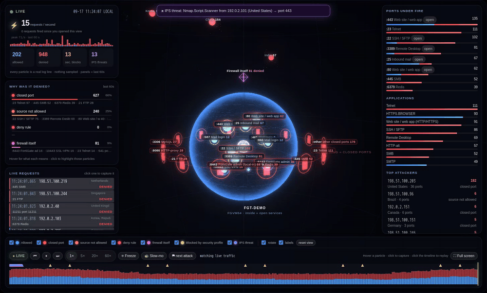
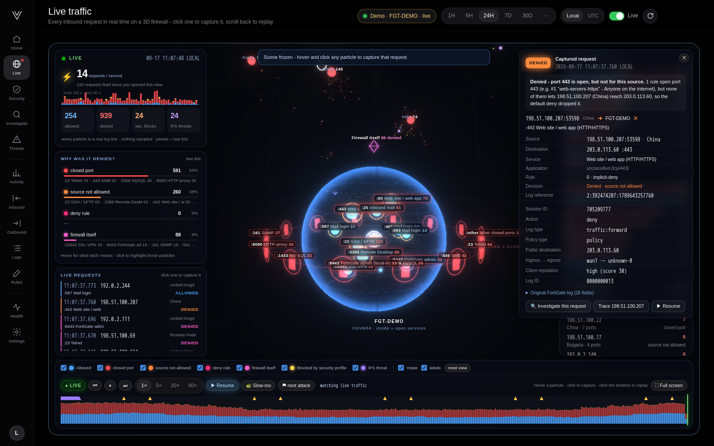
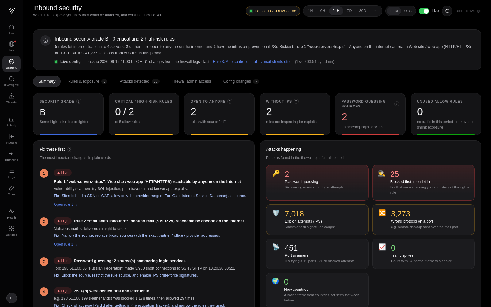

# Vigil: live 3D FortiGate traffic dashboard

**Watch every request hit your FortiGate, in real time, in 3D.** Vigil is a free, open-source, self-hosted FortiGate
syslog dashboard: live attack visualisation, inbound rule risk grading, live configuration-change tracking and
plain-English investigations. It is one Docker container, and the integration is one CLI block on the firewall.

[**Get it on GitHub →**](https://github.com/vigiltech01/vigil) · [Read the blog post](blog/introducing-vigil.md) ·
[FortiGate setup](FORTIGATE.md) · [Install guide](INSTALL.md)



## Install in one minute

```bash
git clone https://github.com/vigiltech01/vigil.git && cd vigil && docker compose up -d
```

Open `http://<host>:8080`, create the admin account and paste the syslog settings into the FortiGate CLI:

```
config log syslogd setting
    set status enable
    set server "<vigil-machine-ip>"
    set port 514
    set format default
end
```

No agent, no API user or token, no firewall password, no FortiAnalyzer, no cloud account. Vigil only listens for syslog.

## What you get

- **Live 3D traffic view:** your firewall as a glass sphere, published services inside, closed ports as doors, every
  inbound request as a particle coloured by the decision (allowed, closed port, source not allowed, deny rule, firewall
  itself, security profile, IPS).
- **Freeze and capture any single request:** rule, NAT, application, reputation and the original log line.
- **Replay** any moment of the day at up to 60× with attack markers; full-screen NOC mode.
- **Inbound security grade:** a 0-100 risk score per internet-facing rule with CISA KEV references, MITRE ATT&CK
  techniques and FortiOS hardening commands.
- **Live configuration tracking** from the FortiGate's own change log: disable a rule and the grade updates in seconds.
- **Investigations in plain English:** *why was 198.51.100.201 blocked?* Hop-by-hop path and correlated sessions over
  30 days.
- **Detections:** port scans, password guessing, exploit attempts, protocol abuse, spikes, new countries.
- Outbound, threats & UTM, activity, log explorer, rule assistant, health page.





## Who builds Vigil

Vigil is built by a small startup building the best open-source security and SIEM tools. **Investors** and
**crowdfunding** backers are welcome: [contact us](contact.md) or [sponsor us on GitHub](https://github.com/sponsors/vigiltech01).

## Documentation

- [Blog: Watch your FortiGate in 3D](blog/introducing-vigil.md)
- [Connecting a FortiGate](FORTIGATE.md)
- [Install guide](INSTALL.md): requirements, HTTPS, backups, upgrades
- [Architecture](ARCHITECTURE.md)
- [Troubleshooting](TROUBLESHOOTING.md)
- [Contact us / investors](contact.md)

---

Apache 2.0 licensed. *FortiGate, FortiOS, FortiAnalyzer and Fortinet are trademarks of Fortinet, Inc. Vigil is an
independent project and is not affiliated with or endorsed by Fortinet.*
